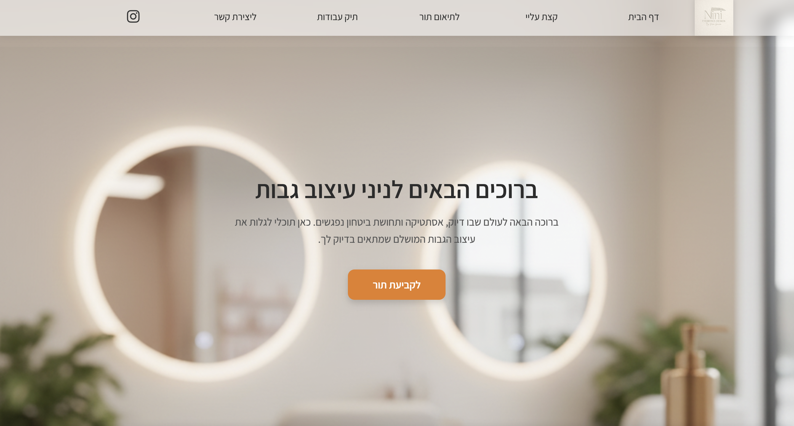
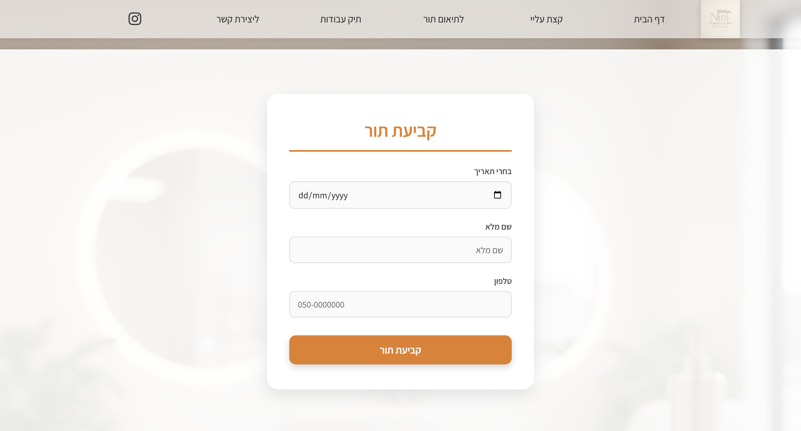

# 💅 Nini Eyebrows Design — Appointment Booking Platform

A full-stack appointment scheduling system built for a boutique eyebrow-design studio. The platform gives clients a fully **Hebrew (RTL)** marketing site with a live booking flow, and gives the studio owner a private, authenticated dashboard to manage her schedule — all synced automatically with **Google Calendar**.

The project was built end-to-end (frontend, backend, database, and cloud deployment) as a real production system currently serving live customers.

---

## 📖 Project Overview

Nini Eyebrows Design solves a common problem for small, appointment-based beauty businesses: replacing manual WhatsApp/phone scheduling with a self-service booking experience, without losing the personal, boutique feel of the brand.

The public site presents a soft, image-led landing page (hero banner, "About Me" section, and a portfolio gallery) that funnels visitors toward a dedicated **booking page**. There, a client picks a date, and the form calls the backend in real time to fetch only the time slots that are still free that day — already-booked hours are automatically excluded. After submitting her name and phone number, the client can instantly add the new appointment to her **Google Calendar** or download an **.ics** file for Apple/Outlook calendars, while the backend simultaneously creates the corresponding event on the *studio owner's* Google Calendar via a server-side OAuth integration.

Behind a hidden `/admin` route, the owner logs in with a username/password to reach a **JWT-protected dashboard** listing every appointment, filterable by month and by status (active vs. cancelled), with one-click cancellation that also removes the event from her Google Calendar.

The result is a lightweight, purpose-built alternative to generic scheduling SaaS tools — tailored to the exact business rules of a single-provider beauty studio (one appointment per client per day, fixed hourly slots, Israeli phone-number validation, Hebrew-first UX).

---

## 🖼️ Visuals

**Landing Page — Hero Section**
Full-bleed studio photography, RTL Hebrew copy, and a prominent call-to-action (`לקביעת תור` — "Book an appointment") leading into the booking flow.



**Booking Form**
A focused, single-purpose card UI: date picker → dynamically-loaded available time slots → contact details → submit. Built mobile-first and fully responsive.



---

## ✨ Key Features

- **Dynamic slot availability** — the booking form queries the backend per selected date and renders only the hours that are genuinely free, rather than a static list.
- **Double-booking protection** — the API rejects a time slot that's already taken and blocks a client from holding more than one active appointment per day on the same phone number.
- **Server-side input validation** — Hebrew-language, business-specific validation for full name, Israeli phone format, and past-date rejection, enforced on both client and server.
- **Two-way Google Calendar integration** — new appointments are pushed to the studio owner's Google Calendar automatically (OAuth2 + refresh token via the Google Calendar API); cancellations remove the corresponding event.
- **Client-side calendar export** — customers can add their own appointment to Google Calendar (deep link) or download a generated `.ics` file for Apple/Outlook calendars, with no backend round-trip required.
- **JWT-authenticated admin dashboard** — a hidden `/admin` route behind login, issuing short-lived JWTs and protecting all appointment-management endpoints with middleware.
- **Appointment management UI** — filter by month and by active/cancelled status, with soft-cancel (status update, not hard delete) and automatic "completed vs. upcoming" badges based on the current time.
- **Fully responsive, RTL-native UI** — a right-to-left Hebrew interface built as a single-page app with client-side routing (marketing pages, booking page, and admin dashboard).
- **SPA-friendly deployment routing** — rewrite rules ensure deep links (e.g. `/booking`, `/admin`) resolve correctly on a static host.

---

## 🛠️ Tech Stack

| Layer | Technology |
|---|---|
| **Frontend** | React 19, React Router 7, Vite 7 |
| **Backend** | Node.js, Express 5 |
| **Database** | MySQL (via `mysql2` connection pool) |
| **Auth** | JSON Web Tokens (`jsonwebtoken`) |
| **Calendar Sync** | Google Calendar API (`googleapis`, OAuth2) |
| **Tooling** | `dotenv`, `cors`, ESLint-ready Vite config |
| **Testing** | Jest & Supertest (backend integration), Playwright (cross-browser E2E) |
| **Hosting** | Vercel (client) · Render (API) · Aiven (MySQL) |

> The project is structured as a single Node package containing both the Express API (`server.js`, `routes/`, `controllers/`, `services/`, `middleware/`, `db.js`) and the Vite/React client (`src/`), rather than separate client/server workspaces.

---

## 🏗️ Architecture & Deployment

```
┌──────────────┐        HTTPS/REST        ┌──────────────────┐        SQL         ┌──────────────┐
│   Client      │ ───────────────────────▶ │   Backend API     │ ─────────────────▶ │   Database    │
│ React + Vite  │ ◀─────────────────────── │ Node.js + Express │ ◀───────────────── │  MySQL        │
│ (Vercel)      │        JSON              │ (Render)          │                     │  (Aiven)      │
└──────────────┘                          └──────────────────┘
                                                    │
                                                    │ OAuth2
                                                    ▼
                                          ┌────────────────────┐
                                          │  Google Calendar    │
                                          │       API            │
                                          └────────────────────┘
```

- **Database (Aiven):** MySQL is hosted as a managed Aiven instance and accessed exclusively through a pooled `mysql2` connection string (`DATABASE_URL`), keeping credentials out of the codebase.
- **API (Render):** The Express server is deployed as a Render web service. On boot it verifies the database connection and ensures the `Appointments` table (and its schema) exists before accepting traffic.
- **Client (Vercel):** The React app is built with Vite and deployed as a static site on Vercel. Since this is a client-side-routed single-page app, [vercel.json](vercel.json) rewrites every path to `index.html` so routes like `/booking` and `/admin` resolve correctly on refresh or direct navigation.
- **CORS:** The API enables `cors()` broadly so the Vercel-hosted frontend (a different origin) can call the Render-hosted API in production.
- **Cross-service calls:** The frontend currently targets the deployed Render API URL directly from the client code. For local development, point this at your local server (see [Getting Started](#-getting-started)).

---

## 🧪 Testing

The project is validated by two complementary automated testing layers, giving confidence in both the API contract and the real user-facing flow before any change reaches production.

- **Backend Integration Tests** — Built with **Jest** and **Supertest**, located in [`__tests__/`](__tests__). These tests exercise the live Express application directly (no HTTP-layer mocking), asserting endpoint-level behavior such as `GET /api/available-slots` returning a valid slot array for a given date, and `POST /api/appointments` correctly rejecting requests with missing required fields. Run them locally with:

  ```bash
  npm test
  ```

- **Frontend E2E Tests** — Browser automation built with **Playwright**, located in [`tests/`](tests), running across Chromium, Firefox, and WebKit. These tests drive a real browser through the actual booking journey — opening the app, navigating to the booking page, interacting with the date picker, and asserting that available time slots render dynamically in response — validating the client and API together exactly as a real user would experience them. Run them locally with:

  ```bash
  npx playwright test
  ```

---

## 🚀 Getting Started

### Prerequisites

- [Node.js](https://nodejs.org/) 18 or later
- A MySQL database (local instance, or an Aiven/managed MySQL connection string)
- A Google Cloud project with the **Calendar API** enabled and OAuth2 credentials (Client ID, Client Secret, and a Refresh Token for the calendar account you want to sync to)

### 1. Clone the repository

```bash
git clone https://github.com/HarelAmarilio/queue-management-system.git
cd queue-management-system
```

### 2. Install dependencies

The frontend and backend share a single `package.json`, so one install covers both:

```bash
npm install
```

### 3. Configure environment variables

Copy the example file and fill in your own values (see [Environment Variables](#-environment-variables) below):

```bash
cp .env.example .env
```

### 4. Run the backend API

```bash
node server.js
```

The API starts on `http://localhost:5001` by default (configurable via `PORT`) and automatically creates the required database table on first run.

### 5. Run the frontend

In a second terminal:

```bash
npm run dev
```

Vite starts the client on `http://localhost:5173`. For local development, update the `API_BASE_URL` constants in `src/services/api.js` and `src/components/Booking.jsx` to point to your local API (`http://localhost:5001`) instead of the deployed Render URL.

### 6. Build for production

```bash
npm run build   # outputs a static build to /dist
npm run preview # locally preview the production build
```

---

## 🔑 Environment Variables

Create a `.env` file in the project root with the following keys:

| Variable | Description |
|---|---|
| `DATABASE_URL` | Full MySQL connection string (host, user, password, database) — e.g. from your Aiven MySQL service. |
| `GOOGLE_CLIENT_ID` | OAuth2 Client ID from your Google Cloud project, used for Calendar API access. |
| `GOOGLE_CLIENT_SECRET` | OAuth2 Client Secret paired with the above Client ID. |
| `GOOGLE_REFRESH_TOKEN` | Long-lived refresh token authorizing server-side access to the studio owner's Google Calendar. |
| `ADMIN_USERNAME` | Login username for the protected `/admin` dashboard. |
| `ADMIN_PASSWORD` | Login password for the protected `/admin` dashboard. |
| `JWT_SECRET` | Secret key used to sign and verify admin session tokens. |
| `PORT` | *(Optional)* Port the Express server listens on. Defaults to `5001`. |

> ⚠️ Never commit a real `.env` file. It is already excluded via `.gitignore` — keep it that way, and rotate any credential that is ever exposed.

---

## 📄 License

ISC

---

<p align="center">Built with ❤️ for Nini Eyebrows Design</p>
